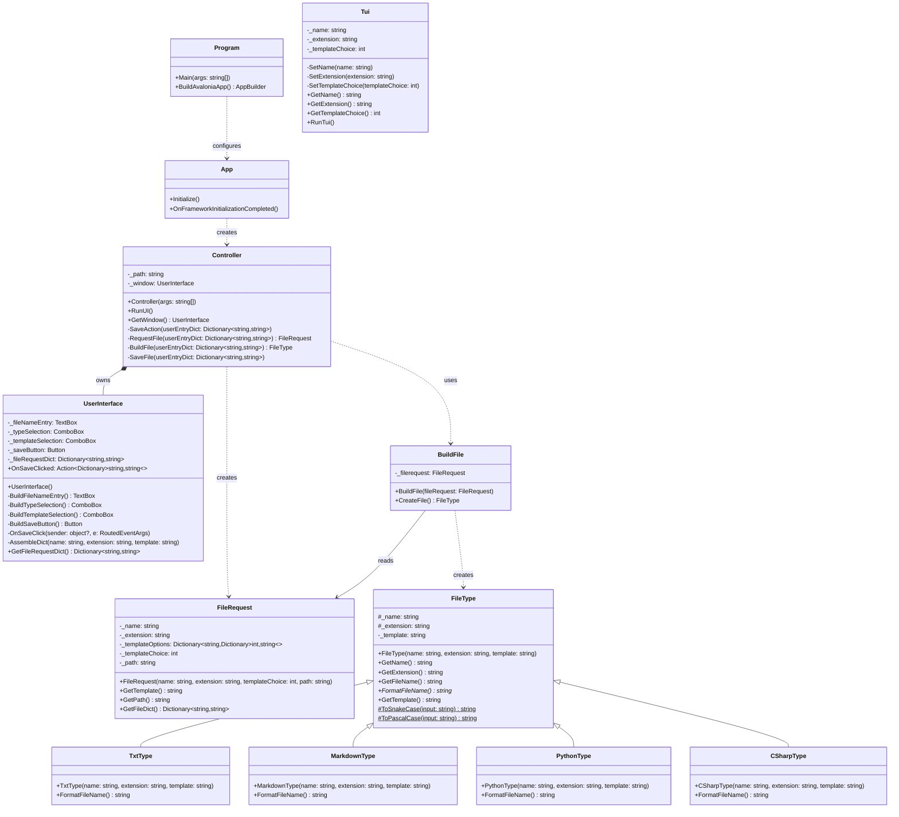

# QuikFile
A simple application to quickly add simple files, such as .txt or .md, when browsing folders in MacOS Finder.

# Installation & Setup
## Install
1. Clone the Repo
   git clone https://github.com/ribeck18/finder-quickfile.git 
   cd finder-quickfile
2. Run the install script:
   chmod +x install.sh
   ./install.sh

## Setup
1. In MacOS shortcuts app create a new shortcut
2. Add a run shell script action. Paste the following: osascript -e 'tell application "Finder" to get POSIX path of (target of front window as alias)'
- set shell to zsh
- set input to stdin
3. Add a second Run Shell Script action. Paste the following: folder="$(printf %s "$1" | tr -d '\r\n')"/usr/local/bin/QuickFile-files/QuickFile "$folder"
- Set shell to zsh
- set input to Shell Script Result
- set pass input as arguments
4. Assign a keyboard shortcut (I used option command B)

# Updates
To update the program do the following
1. pull from GitHub
2. Rerun the install script: ./install.sh

# Troubleshooting

**The application to execute does not exist**
The install script did not copy the files correctly. Verify the files exist by running:
   ls /usr/local/bin/QuickFile-files/
You should see QuickFile, libAvaloniaNative.dylib, libHarfBuzzSharp.dylib, and libSkiaSharp.dylib.
If not, rerun the install script.

**Read-only file system error**
You are trying to save to a system protected directory. Make sure you have a regular user accessible folder open in Finder before triggering the shortcut.

**App opens but saves to the wrong location**
Make sure the second shell script in your Shortcut has Pass Input set to as arguments and not to stdin.

**macOS blocks the app from running**
Run the following commands in terminal:
   chmod +x /usr/local/bin/QuickFile-files/QuickFile
   xattr -cr /usr/local/bin/QuickFile-files/

**Nothing happens when the shortcut is triggered**
Make sure Finder is open with at least one window before triggering the shortcut. The AppleScript command requires an active Finder window to get the path.

**App crashes immediately**
Make sure you have .NET 10 SDK installed. You can verify by running:
   dotnet --version

# Class Diagram

